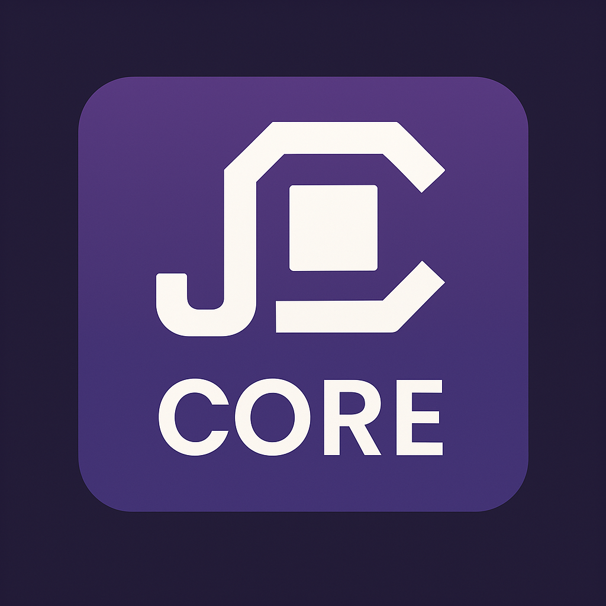

<p align="center">
  
</p>

<h1 align="center">JCore — Johan's Interpreted Language</h1>

<p align="center">
  <b>Ultra-fast, minimal scripting language made in C#.</b>  
  <i>MIT licensed, runs anywhere .NET NativeAOT!</i>
</p>

<p align="center">
  
  
</p>

---

## ✨ Features

- ✅ **Constants & Variables:** `let`, `make`
- ✅ **Full math expressions:** with operator precedence
- ✅ **BigInteger math:** no overflow, infinite size!
- ✅ **Simple commands:** `say`, `let`, `make`
- ✅ **Inline & multiline comments:** `//`, `/* ... */`
- ✅ **Script files** & **REPL** support

---

## 🚀 Getting Started

### Run a Script

```bash
JCore.exe Examples\hello.jc
Or simply drag and drop a .jc file onto JCore.exe!

Try the REPL
Just run without arguments:

bash
Copy
Edit
JCore.exe
Type your code, press enter — supports say, math, and more.

🧑‍💻 Example
say "Hello, World!"
let x = 12345 * 67890
say x

```
📄 License

JCore is licensed under the [MIT License](LICENSE).

<p align="center"><sub>Made with ❤️ by Johan Raphael Joe</sub></p>
